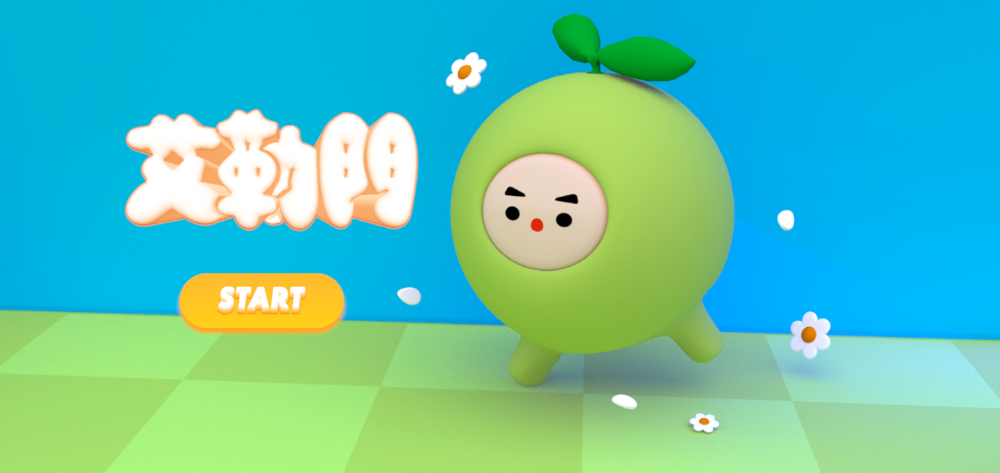

<h1 style="font-size: 28px;">艾勒門(Element) - 多人連線 3D 射擊共鬥遊戲</h1>

艾勒門是一款使用 Unity 製作的 3D 多人連線射擊共鬥遊戲，玩家可選擇代表五行元素（金、木、水、火、土）的角色組隊挑戰 BOSS，遊戲搭配彈幕射擊模式與技能合作，最多可四人同時遊玩。

<h2>執行平台</h2>

本系統在Android平台運行，支援Android手機與平板裝置。

<h2 style="font-size: 20px;">系統畫面展示</h2>

點擊圖片觀看操作影片

<h2>遊戲特色</h2>
<ul>
  <li>五種角色對應五行屬性：金、木、水、火、土，各自擁有獨特技能與攻擊方式</li>
  <li>多人合作模式，透過 Photon 連線與朋友共鬥</li>
  <li>彈幕型 BOSS 攻擊機制，考驗閃避與團隊配合能力</li>
  <li>戰鬥後依據表現進行計分排名，可與其他玩家競爭高分</li>
</ul>

<h2>操作方式</h2>
<ol>
  <li>啟動遊戲後，選擇角色並進入房間，可自訂單人或組隊挑戰</li>
  <li>使用虛擬搖桿控制移動與施放技能，並閃避 BOSS 攻擊</li>
  <li>擊敗 BOSS 後進入結算畫面，查看分數與排名</li>
</ol>

<h2>開發工具</h2>
<ul>
  <li>Unity 2019.4.3f1（建議版本）</li>
  <li><strong>Photon PUN 2</strong>（多人連線應用）</li>
  <li><strong>Joystick Pack 插件</strong>（控制角色移動與技能方向）</li>
  <li>C# / Unity API</li>
  <li>Android Build Support</li>
</ul>

<h2>專案結構說明</h2>
<ul>
  <li><strong>多人連線模組</strong>：
     使用 Photon PUN 處理連線、房間建立與玩家同步。
     代表腳本：<code>PhotonLobby.cs</code>、<code>PhotonRoom.cs</code>、<code>GameSetup.cs</code>
  </li>
  <li><strong>角色控制與動畫</strong>：
     實作角色移動控制、動畫切換、技能拖曳方向等功能。
     代表腳本：<code>joycon.cs</code>、<code>joycon_skill.cs</code>、<code>Player_Animation.cs</code>
  </li>
  <li><strong>技能與戰鬥互動</strong>：
     每個角色擁有對應技能，包含傷害、控制、回血與狀態變化。
     代表腳本：<code>skill_gold.cs</code>、<code>fire_skill01.cs</code>、<code>boss_.cs</code>、<code>bullet.cs</code>
  </li>
  <li><strong>UI 與介面互動</strong>：
     涵蓋角色選擇頁面、房間介面、介面開關與提示說明。
     代表腳本：<code>Launcher.cs</code>、<code>CharacterINFO.cs</code>、<code>MenuManager.cs</code>
  </li>
  <li><strong>場景與特效管理</strong>：
     包含血量條、BOSS 死亡動畫、結算畫面與場景跳轉。
     代表腳本：<code>healthBar.cs</code>、<code>END_score.cs</code>、<code>Failed.cs</code>
  </li>
</ul>

<h2>製作團隊</h2>

<strong>匿名工作室（大學畢業製作團隊）</strong>

<ul>
  <li><strong>我：</strong>多人連線、場景建置、角色動畫、技能互動、介面互動</li>
</ul>
